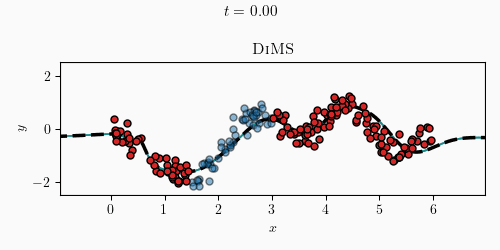

# Don't Stop Me *Yet*: Sampling Loss Minima via Dissipative Riemannian Mechanics

Official repository for the paper <i>"Don't Stop Me **Yet**: Sampling Loss Minima via Dissipative Riemannian Mechanics"</i>. 

In the paper, we propose the **di**ssipative **m**inima **s**ampler (or DiMS), which samples loss minima based on a dynamical system motivated by classical mechanics on Riemannian manifolds.

  

### Installation

Create a conda environment, e.g. with the following command:
    
    conda create -n dims python=3.12 -y

Then clone the repository and install it by running the following command within this folder:
    
    pip install .

### Example: the Snelson dataset

We provide an example of how to sample with DiMS in the `snelson_example.ipynb` notebook, including a comparison with the standard Laplace approximation, linearized Laplace and the Riemannian Laplace approximation.
