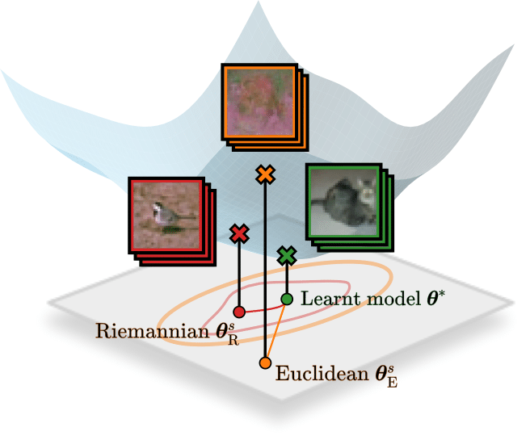

# Reducing Memorisation in Generative Models via Riemannian Bayesian Inference 

Official repository for the paper <i>"Reducing Memorisation in Generative Models via Riemannian Bayesian Inference"</i>. 

**Note:** The code will be released soon...

    

