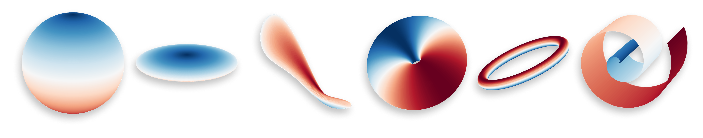
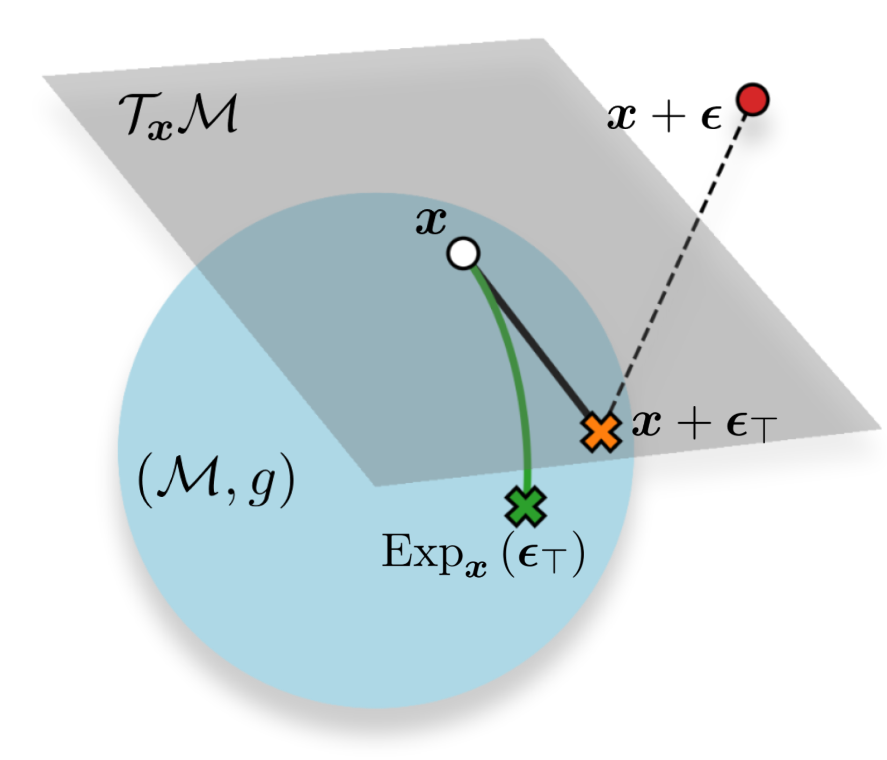

# Staying on the Manifold: Geometry-Aware Noise Injection

Official repository for the paper <i>"Staying on the Manifold: Geometry-Aware Noise Injection"</i>. 

The repository contains a framework for sampling points on the tangent space, generating geodesics and evolving Brownian motion for some parametrised manifolds and deformed versions of these.

| Considered manifolds | Methods applied |
|----------------------------------------------------------------------|-------|
|  |  |

### Installation

You can either clone the repository and run:
    
    pip install . 
    
within the folder. Or directly run
    
    pip install https://github.com/albertkjoller/geometric_noise

### Example: computing geodesics

    from geometric_noise.manifolds import Sphere
    from joblib import Parallel, delayed

    # Define manifold
    manifold = Sphere(return_torch=True)

    # Generate some points in the local coordinates
    U = torch.tensor([[1/2*torch.pi, 0.], [1/2*torch.pi, 1/2*torch.pi]])

    # Compute geometric quantities at these points
    geometric_quantities = manifold.get_quantities(U)
    
    # Compute Gaussian covariance in the parameter space for each point
    transformed_covariances = geometric_quantities['J_inv'] @ geometric_quantities['P'] @ geometric_quantities['J_inv'].transpose(-1,-2)

    # Cholesky decomposition for efficient sampling
    Ls = torch.linalg.cholesky(transformed_covariances)

    # Sample initial velocity vectors
    noise_intensity = torch.tensor(0.1)
    init_vs = torch.sqrt(noise_intensity) * torch.einsum('ijk,ik->ij', Ls, torch.randn_like(U))
    # Combine in initial states for the exponential map
    init_states = torch.hstack([U, init_vs])
    
    # Compute geodesics on the manifold from the associated parameter space curve (here, in parallel)
    geodesics = Parallel(n_jobs=-1)(delayed(lambda state: manifold.geodesic(state[:2], state[2:], geodesic_res=101)[0])(init_state) for init_state in init_states)

    # The solution of the exponential map is the endpoint 
    X_noisy = torch.stack(geodesics)[:, -1, :]

### Example: Brownian motion on the manifold

    # Compute endpoint of Brownian motion on manifold from the associated random process in local coordinates 
    BMs_on_manifold = torch.vmap(lambda u: manifold.brownian_motion(u[None, :], diffusion_time=noise_intensity, num_steps=100, return_trajectories=False)[0], randomness='different')(U)

    # Use the endpoint as the noisy sample
    X_noisy = BMs_on_manifold[:, -1, :].squeeze(1)

## Reproducibility
The experiment can be reproduced by running `run_experiment.sh manifold_name` with `manifold_name` being one of:
- `sphere`
- `squeezed-sphere`
- `deformed-sphere`
- `onion-ring`
- `bead`
- `swiss-roll`
